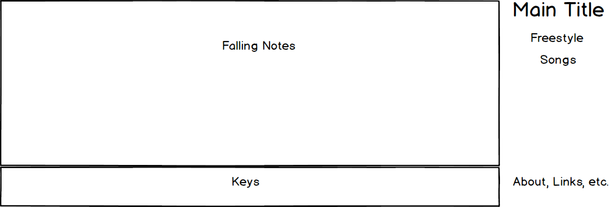

# Keyboard

## Background

Keyboard allows users to turn their keyboard into a keyboard. Users can play as if their keyboard is a piano,
either freestyle or to included song charts which require the user to play the correct notes at the right time. Upon completing a song, users receive a letter grade based on their performance!

## Functionality & MVP

- [ ] Allow users to play freestyle
- [ ] Allow users to play along to songs of varying difficulty
- [ ] Assign a letter grade based on the performance of the user
- [ ] Lastly, a production README will be included.

## Wireframes

This app will consist of a single screen with a section on the bottom for keys, the main section which displays notes which fall towards the keys and must be played at the right time, and a sidebar with the main title, levels, and links/info. Songs will list several songs of varying difficulty to play along to.

## Architecture and Technologies

This project will be implemented with the following technologies:

 - Vanilla JavaScript and `jquery` for overall structure and logic
 - `Easel.js` with `HTML5 Canvas` for DOM manipulation and rendering
 - Webpack to bundle and serve up the various scripts

 In addition to the webpack entry file, there will be several scripts involved in the project:

 `board.js`: this script will handle the logic for creating and updating the necessary `Easel.js` elements and rendering them to the DOM.

`logic.js`: this script will handle the logic behind the scenes. Audio files will be played once keys are pressed, and the timing of key presses will affect a user's performance rating.

 `note.js`: this script will house the constructor function for the `Note` class, which will have a key value and velocity based on the tempo of the song.

 ## Implementation Timeline

 **Day 1**: Set up all necessary Node modules, including getting webpack up and running and Easel.js installed. Create webpack.config.js as well as package.json. Write a basic entry file and the bare bones of all scripts outlined above. Learn the basics of Easel.js. Goals for the day:

 - Get a green bundle with webpack
 - Learn enough Easel.js to render an object to the Canvas element

 **Day 2**: Dedicate this day to learning the Easel.js API. Rectangular `Note` objects will "fall" down the `Board` object towards the keys at the bottom of the page, which will correspond to different keys on the keyboard. Goals for the day:

 - Complete the `note.js` module
 - Render the keys and board using `Easel.js`

 ** Day 3**: Create the backend logic and songs (arrays of notes) which can be played by the user. Goals for the day:

 - Complete the `logic.js` module which will handle the backend logic of the application.

 **Day 4**: Install the controls for the user to interact with Keyboard. Style the frontend, making it polished and professional. Goals for the day:

 - Create controls for users to play keys and produce sounds
 - Render everything in a polished and aesthetically-pleasing way

## Bonus Features

- [ ] Add option to record songs to be played back
- [ ] Add leaderboards for high scores
- [ ] Add additional songs
